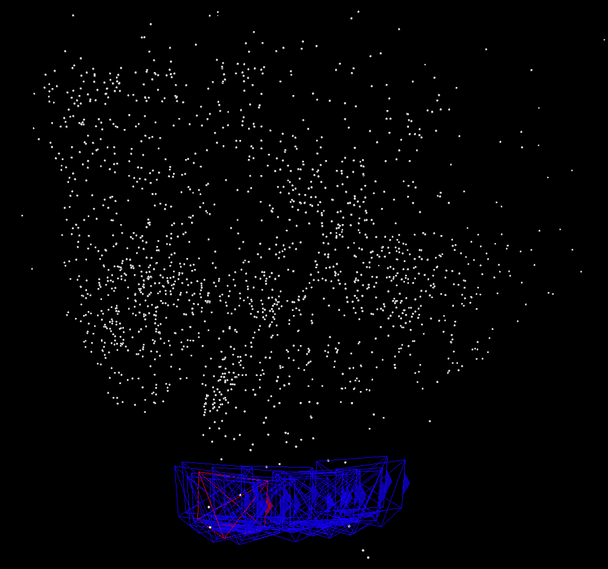
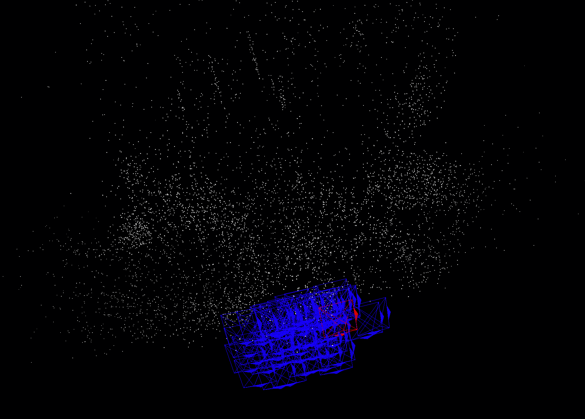

# Project-4 Structure-from-Motion

## 0. Implementation details
1. feature extraction: SuperPoint
2. feature matching: SuperGlue and knn match(based on superpoint descriptors' similarity)
3. triangulation: DLT(self-implemented)
4. pose estimation: PnP(opencv)
5. bundle adjustment: g2o

## 1. Run the code:

1. prepare the required data, put them into the ./data/ folder: 
   * [llff-fern](https://drive.google.com/drive/folders/128yBriW1IG_3NJ5Rp7APSTZsJqdJdfc1);
   * [llff-trex](https://drive.google.com/drive/folders/128yBriW1IG_3NJ5Rp7APSTZsJqdJdfc1);
   * [templeRing](https://drive.google.com/drive/folders/128yBriW1IG_3NJ5Rp7APSTZsJqdJdfc1);
2. `pip install -r requirements.txt`
3. `cd python`
4. reconstruct llff-fern:  `python main.py --config configs/llff_fern_superpoint_superglu.yaml`
5. Reconstruct llff-trex: `python main.py --config configs/llff_trex_superpoint_superglu.yaml`
6. Reconstruct templeRing: `python main.py --config configs/templering_superpoint_superglu.yaml`

7. If you want to visualize the resulting point clouds and camera pose, run `main.ipynb` by Jupyter.

## 2. Camera trajectory evaluation

1. rotation evaluation using evo_rpe:  evo_ape tum xxx_gt_trajectory.txt xxx_est_trajectory.txt -asp -r angle_deg

   * Llff-fern:

     Rotation_rmse in degree: $5.23^\circ$

   * Llff-trex:

     Rotation_rmse in degree: $2.60^\circ$

2. translation evaluation using evo_rpe: evo_ape tum xxx_gt_trajectory.txt xxx_est_trajectory.txt -asp -r trans_part

   * Llff-fern:

     Translation_rmse in meter: $0.028$

   * Llff-trex:

     Translation_rmse in meter: $0.057$

     

## 3. Result Analysis

1. Visualization results using ipvolume:

   the red/blue wireframes are cameras(the red one is the final camera pose), white points represent point clouds.

   * Llff-fern:

     

   * Llff-trex:

     

   * templeRing:

     

2. Analysis:
   * Camera poses are heavily drifted on the templeRing data: Since we adopt a incremental method to estimate the camera pose and point clouds, the error will be accumulated. If a loop closure method is applied, the error will be reduced.
   * The sparse point cloud is still inferior to that of colmap: One of the reasons is that the feature extraction and matching is not accurate enough. If we use a more powerful feature extractor and matcher, the result will be better. Another reason is that my DLT triangulation method is not accurate enough, which will be improved to midpoint triangulation in the future.
   * The mechanism of keyframe selection is not perfect: Currently, I only select the keyframe based on a fix-number interval of input frames. If we use a more sophisticated method, the result should be improved.
   * Non-linear optimization should be applied after each step of triangulation and PnP.

## 4. Reference
1. [Hierarchical Localization at Large Scale with Superpoint Graphs](https://arxiv.org/pdf/2007.01578.pdf)
2. [Python-VO](https://github.com/Shiaoming/Python-VO)
3. [3D Reconstruction using Structure from Motion](https://github.com/harish-vnkt/structure-from-motion)